# 云感知应用架构

翻译：**linxuhua:** (hualee215 AT gmail.com)
原文：[architecting_cloud_aware_applications](https://opendatacenteralliance.org/wp-content/uploads/architecting_cloud_aware_applications.pdf)

[TOC]

## 应用程序架构演进历程
应用程序体系结构跟随计算机硬件、 网络和设备从个人电脑到智能手机同步发展至今。云计算作为最新的进化力量，正在改变应用程序体系结构。要了解云计算正在怎样改变应用程序体系架构，思考在常规非云环境应用是如何架构。
### 多层应用架构
比如典型的三层架构由展示层、中间层、数据层三层构建
- 展示层提供用户访问接口
- 中间层接受用户请求并执行应用业务逻辑
- 数据层提供数据存储服务

比如典型的邮件服务器架构，展示层使用outlook类似的客户端，中间层消息服务器ExchangeServer，后端的消息存储数据层；中间层通过应用协议(IMAP)提供api服务给客户端调用，中间层往往会与多个后端服务存在接口，比如邮件系统中，中间层会与用户体系的目录服务、消息存储服务、消息传输代理等有接口。

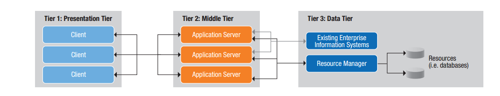

三层架构词条：解释略

### 虚拟环境中的多层应用架构
随着数据中心虚拟化技术的应用，越来越多的应用部署在虚拟化环境中，这样可以节省更多的成本和资源调配的时间。
对于应用程序来说，虚拟化环境几乎都是同质化的，包含应用的构造方法、配置静态数据等。由于虚拟环境可以根据需求创建和配置新的应用组件的实例，配合虚拟感知的负载技术、虚拟IP技术使扩展变得更容易，而且每层的独立扩展相对于其它层来说都是透明的。

## 云应用架构
在云环境开发应用时，开发人员不一定非的改造应用的架构来适应云环境，开发人员照样可以把应用部署在云环境中，比如使用P2V方法，把物理机的应用原样迁移到虚拟机中，但是这样会妨碍应用使用云的特殊功能。比如原来的多层部署模式，耦合了依赖层的相关信息(服务信息、IP地址、web相关配置等)，这样就无法做到自动化扩展到多个虚机或私有、公共云的多个实例。如果要有效地利用云的功能，那么应用在设计架构时，就要基于云的思想和特性去考虑应用的架构，包含弹性、自助服务、多租户等等。例如下图展示的传统多层和云应用比较。

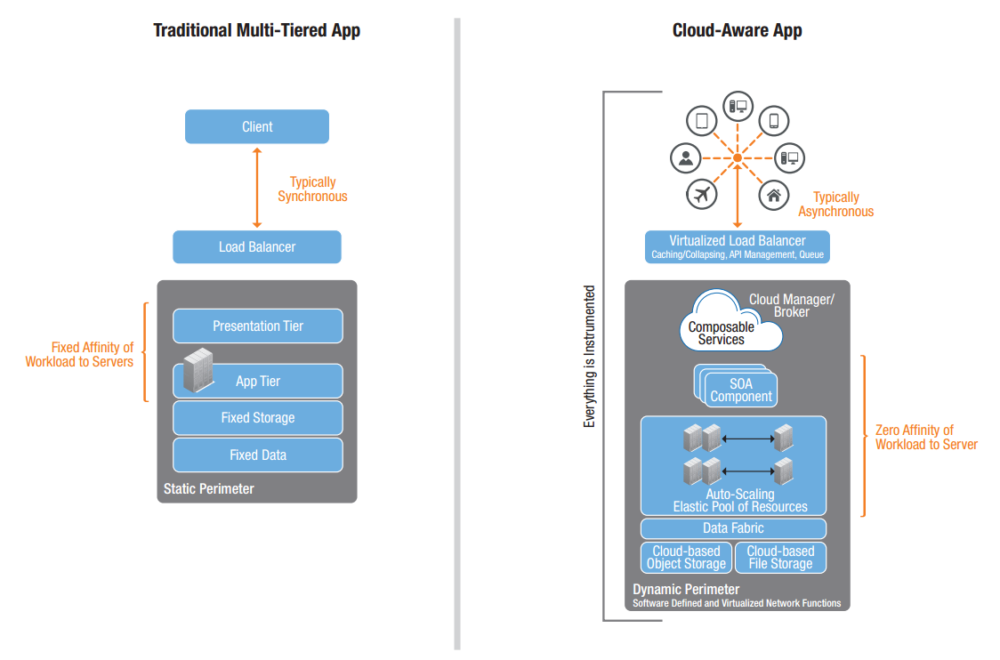

### 云应用架构原则
本节概述了云计算的应用程序体系结构的根本原则，表 1 列出了架构原则:它影响应用程序自身是如何组织、编码、确定最终用户怎样与之交互；表 3 总结了运维准则：它考虑了整个系统，包括如何部署应用程序的工作原理和操作，以及其他系统组件如何与之进行交互。

这些原则一般适用基于特定应用程序的上下文，并可能随着时间的推移逐步实施。在开发云知道应用程序时，表中优先级为高的原则应该优先考虑，低优先级的原则在云感知的架构中并不显得那么重要。

表 1. 架构原则

| 序号 | 原则 |描述|优先级
|--------|--------|---------|----------|
| 1|故障弹性 |弹性设计到应用程序中，而不是事后对应用的包装。这样对云计算基础设施的故障能够不中断服务的流畅处理|高|
| 2|延迟弹性 |优雅延迟的应用胜于超时或中断的应用|高|
| 3|安全性|应用程序是基于生命周期的安全标准，包括内置的安全性。 落地的数据和传输的数据是加密的，API有认证和授权的保护|高|
| 4|位置无关|应用应动态的发现服务，而不是依赖硬编码|高|
| 5|弹性可伸缩|应用程序响应需求的级别，伸缩的需求，以及云自身特性支持|高|
| 6|SOA/组件化|应用的消费端和web服务的apis暴露提供端能够做到运行时可发现，架构结合轻量级、无状态的可扩展组件设计原则|高|
| 7|可管理性|应用可被检测，并能暴漏其度量数据和管理接口|中|
| 8|基础设施无关|应用程序不应该有任何的基础设施假设条件，应建立在抽象层的操作系统、文件系统、数据库等等之上|中|
| 9|租户定义|每个应用都应该定义一个成熟的单租户隔离和多租户共享的模式|中|
| 10|最终用户的自助服务|用户应该能够自助注册，并使用自助服务使用应用，而不是通过IT服务申请|中|
| 11|带宽感知|应设计尽量减少带宽的api和应用协议|低|
| 12|资源和成本的消耗感知|应设计尽量减少带宽、 CPU、 存储消费量和输入/输出请求的应用架构来减少费用支出|低|

接下来详细介绍云计算的应用程序的架构原则。这些原则指导应用程序是如何组织和编码，并确定最终用户如何与它进行交互。

#### 故障弹性

在大规模可伸缩的云计算环境中，应用程序很可能会被某些故障中断。潜在的故障包括计算的硬件故障、网络或存储物理设备故障、在应用程序组件或云服务软件故障、网络故障导致应用组件的迟钝或瞬间断链问题。为了抵御这些类型的故障，应用程序的架构必须能够无需人工干预且能够无缝处理这些故障，无论是通过用降级处理性能水平还是优雅功能降级策略。

#### 延迟弹性
云应用一般运行在多租户、共享的环境。在相同环境的其它应用产生的负载在响应时间和网络延迟上创建高可变性优于专用的固定数据中心基础设施。云应用程序必须设计为能够很好的处理这些延迟。开发者开发一个弹性应用时，一般都会花较多的精力在应用延迟上。 对于云中的应用程序，有延迟弹性能力至关重要。在云中基础设施故障导致连接延迟存在多重形式。例如：
 * 网络拥堵或者网络隔离
 * 不可扩展的技术架构服务中的请求争夺
 * 存储系统I/O带宽饱和
 * 共享服务中的软件故障
 * 拒绝服务攻击导致的服务故障或者资源的枯竭

 移动应用程序的开发人员已经有开发技术处理不可靠的网络连接，这些同样适应于云。例如：
  * 请求队列. 实现一个请求队列和重试机制，以确保请求永远不会丢失。这可以确保应用程序的状态不会损坏。重试不可能在所有情况下都是需要的，例如，允许请求超时可能是可接受的在应用下次轮训服务时数据可用。此时放弃写入请求没有任何意义。
  * 优雅地处理故障. 如果发生故障，优雅地处理它。例如，当一个服务响应很慢时，不要阻塞应用。相反，返回一个响应说明请求正在被执行(异步化)。

延迟是在所有网络分布式系统中影响性能的一个因素。光速定义了在两个网络节点之间可能的最低延迟。在最好情况下，旧金山和纽约两地的服务之间的延迟时13.8毫秒，或27.6毫秒一个往返。在现实中，等待的时候还要高的多，由于网络连路中信号的衰减、协议的开销和延迟导致的网络交换机和网络拥堵。据AT&T测量旧金山和纽约之间的延迟实际为70毫秒。

延迟随着时间而变化，具体依赖于网络的传输容量和路由规则.

#### 安全性
无论应用是否在互联网上，安全都无处不在。企业和公共网络环境之间的界限越来越模糊，随着移动电话设备和软件即服务应用的集成使得应用和服务变得越来越开放. 应用程序应该加密所有的传输数据，加密存储在云存储上的数据，实现安全认证和授权访问控制，以及开发人员应该采用的安全编码实践。

在受防火墙保护的数据中心，开发者假定在数据中心内网络相对安全的，通信可以无需加密。在这种环境下，应用程序需要保护用户的应用或者浏览器与数据中心DMZ区域的应用服务之间的通信。然而在云应用中，不存在防火墙保护该应用后端组件之间的通信，尽管这些组件不暴漏在互联网上，他们在一个无法保证安全的多租户网络中。这就降低了保护等级到最低的普通水平。如果网络不能被信任，开发者必须加密应用的通信和它通过API暴漏的服务。
不能低估在私有云环境中部署应用的安全问题，因为应用程序最终可能过渡到公有云和混合云。安全应在每个应用程序中优先考虑，不能在事后弥补。
* 传输中加密数据 分布式应用依赖于网络来发送请求和接收响应，通过网络传输数据的安全性和完整性必须得到保护。正如实用安全协议通过互联网传输敏感信息是有必要的一样，开发者在云环境中应采用同样的方法。安全的网络协议、比如SSL和HTTPS，必须被使用以防止网络流量被侦听和中间人劫持的攻击。注意，这也包含有云服务商提供的服务，以及第三方的服务。实际上，所有的网络通信都应该被加密。
* 控制API的访问 应用组件和服务暴漏的API服务也必须受到保护。应用程序的API访问可以通过Oauth的授权和访问控制的API管理解决方案来管理。使用这种方法，开发者可以限制API的消费者和API的提供者之间的通信，仅让授权过的消费者访问API。
不幸的是，API管理不是大多数公有云的典型功能。开发人员为了加密组件之间的通信必须使用诸如SSL和HTTPS等协议实现自己的身份验证方法，比如OAuth方案。

* 加密落地数据 如果网络不是安全的，网络中的数据就会有暴露的风险。因此，应用应该对写入存储的敏感数据进行加密处理。云提供商可能提供加密的存储服务来保护从第三方介入的存储数据，但是如果云供应商拥有私钥，这种保护就存在严重的不足。应特别保护个人的身份信息，确保银行卡信息是使用支付卡工业数据标准的加密处理，并符合HIPAA（Health Insurance Portability and Accountability Act）法案应用程序保护敏感的健康信息。

应用程序只有在网络通信、访问、数据存储都在可控制之下后，才算是安全的运行在云环境中。

#### 位置无关
或许，常规的托管主机应用与云中的应用之间的显著不同点在于，前者的网络拓扑几乎是不会改变的。例如，云服务供应商会动态的改变网络路由，以减少拥堵，共享服务可能会转移到新的虚拟主机上，网络也会更着变化，乃至一个应用的不同组件会跨不同云供应商。

如果使用硬编码的IP地址会锁定应用的配置，但这将使应用变的脆弱，对变化非常敏感，并限制它的弹性扩展能力。

为了充分利用云环境的功能，应用程序需要设计在动态变化的环境中，服务实例和应用组件可以自由的起停。在这种环境中，应用不能假定那些服务为特定的请求响应，或者特定网络地址的服务。随着负载的增加，新的实例会创建，弹性的伸缩以适应负载。云服务提供商提供自动伸缩能力，监控负载，根据开发者指定的规则增减服务实例。与自动伸缩协调，弹性负载平衡自动处理负载到可用的实例上，停用不可用的实例。

开发者应该架构应用以支持云的动态特性。最佳实践如下：

* 不能有硬编码的配置信息(IP等)。考虑使用或实现服务发现，应用程序组件的服务能查询并确定一个给定的动态服务的位置信息。
* 应用程序组件必须是无状态，假设应用程序无状态，因此，如果一个实例因为自动伸缩下线，不会发生数据丢失。相反，一个新实例启动时，它不应该有确定的状态。
* 应用程序应该使用既有的公认协议，比如HTTPS。以避免程序组件到网络细节的耦合
* 应用程序应该设计为可利用云基础设施提供自动伸缩能力。
运维上，考虑以下因素:
* 利用API管理来代理API，让它作为中间人屏蔽API消费者到服务提供者之间的调用细节。

#### 弹性可伸缩
弹性时云计算的一个基本原则。弹性使应用程序可以在后端自动扩展以响应负载的变化。这种可扩展性实际上使得基础设施要消耗更多的成本，提供富裕的基础设施为了扩展。应用程序必须设计特殊的架构支持可伸缩。弹性扩展不能凭空产生，简单来说，应用程序应该设计为小、无状态的组件，更好的支持扩展。
#### SOA/组件化
可发现使应用可以动态定位组件，而不是静态的绑定到特定的实例。在云中，当一个应用的组件存在很多实例，且经常会发生故障时这种能力特别重要。通过应用的组件发现(无状态),新组件启动，无需任何更改既可以处理负载。避免使用持久化状态数据也可以在这方面有所帮助。

分解应用功能进程到单一用途的组件达到重用，方便灵活的可伸缩特性，支持敏捷开发。例如，不是架构一个单一消息存储组件，分解功能到更小的方法组件处理存储的消息，获取消息，查询消息等等。用这种方法，一个改进搜索实现可以无任何影响的部署或者升级。
#### 可管理性
在云环境中，应用程序依赖基础设施和云服务提供商管理服务。通常情况下，提供者的目标与开发者的目标一致。提供者想提供可靠的服务，并确保高可用性。然而，供应商没有对开发者的应用进行特定的支持。它不需着眼于共享云服务的整体可用性。例如，有些云供应商关闭了服务，刻意划分网络隔离故障问题，不经意间会在排查问题的操作中产生共享基础设置的故障。这些所有的动作都可能会影响开发者的应用程序。不幸的是，应用程序的所有者并没有云管理员的控制权限，不会收到他们想获取的所在数据中心技术运营团队所拥有的同级别相信信息。实际上，应用程序的拥有者在解决问题上没有任何控制权，在方案选择上没有投票权，在一些云提供商那里，没有任何解决的途径。

云管理员并不会为开发者管理和优化应用程序，这些需要开发者自己来做。必须要明白的是云的基础设施在应用程序开发者的控制之外。一种手段可以让云基础架构的问题可见，比如请求和服务处理超时。应用所有者的管理和监控工具可以确保这些数据是可见的，这样他们就能快速响应云基础设施的故障。

多个应用部署在云中，它们依赖于一些同一组织维护的共享服务，但是看起来这些服务被不同的管理人员维护者。

#### 基础设施无关
维护基础设施的独立性一直都是推荐的软件工程实践，但是在云环境中使用云供应商专有的接口导致对供应商的依赖。供应商的依赖会降低移植性，使得很难或者根本不可能运行在其它的云环境中。应用抽象后，应用可以不需要重写仅仅替换后端服务的实现。

数据中心的设备往往是多样性的。一个应用程序可能运行在linux系统上，但是它依赖的数据库可能运行在windows的系统上。开发者会选择能够很好满足他们开发和运行环境的平台，系统工程师可能也有标准的各类系统配置服务。这种方案的结果在一个多样性的环境中通常是可控的。

云环境同样也是多样化的。他们提供一系列预先配置好软件和操作系统的虚拟机镜像。不幸的是，默认的镜像可能与应用程序的需求不匹配。例如，一个windows的虚拟机镜像可能没有SQL Server需要的操作系统级别的补丁。利用可用的镜像往往限制了移植性，因为在跨云的环境中没有完全一样的镜像。表面上一致但是存在微小环境差异的虚拟机镜像往往会导致应用的运行问题。
解决镜像多样性的问题可以通过为应用建立定制的镜像。使用以下方法是成熟的解决：

* 创建一个精确环境的虚拟机镜像
* 采用镜像壳子模式并在启动时可以根据必须的配置自定义它
* 创建适用于应用程序的最佳基础设施配置首选项套餐(通过中间人或管理员定义最适合应用的配置)

运行时配置提供一种安装补丁以确保实例为最新兵允许创建多种类型的配置机会。例如，为特定linux版本创建一个标准镜像，然后配置一个安全的配置文件，更新到特定的java版本，随后配置使用不同的java运行容器。使用层叠的方式一层层叠加。运行时配置的不好的地方在于业务启动上线时间长，可能会影响实例的自动伸缩。

随着广泛采用TCP作为互联网的标准传输协议，云应用程序不需要关心网络的异构性。应用层协议比如HTTP提供上层抽象，流行的REST架构模式基于HTTP提供的便利方式，使分布式应用通过JSON和xml的数据表现形式暴露服务让数据在组件之间传输。其局限性时缺乏标准的API设计或请求／响应的格式。例如，实现可能表现API版本在资源路径中(例如，/api/v1/users),或者查询参数中(/api/users/version=1)，或Accepter的头中(accepter:application/json;apiversion=1).

这样，应用不能确保API的设计或者报文内容能跨越不同的API提供者。除了使用标准的协议，如HTTP/HTTPS,开发人员应该建立REST API设计标准，使他们的API是一致且易用。对于基于SCHEMA定义可以被发现和消费的服务，这个标准化级别在将来将越来越重要，而不是硬编码到程序中。

#### 租户定义

除非最初就是设计为SaaS的应用，大多数企业应用程序都不会考虑租户的因素。尽管如此，最佳的建议是理解和处理租户模型应该是云感知应用的一个组成部分。考虑将来可能产生的影响，如果另外一组用户想使用一个开发者的应用程序，则必须把他们的数据隔离开来。此外，考虑表分离和标记数据(在一个共享表)在这种场景下简化约束的条件。

#### 最终用户的自助服务

当用户请求访问应用时，许多企业应用需要某些类型的授权，把用户与一个特定的角色相关联并对其进行授权。最终，用户的配置信息里会产生其能够访问的资源信息。在消费者的应用中，应用提供自注册工具。相同的概念，在企业应用中，用户也期待有同样的类似能力。

#### 带宽感知

一个简单的假设：在云环境中，带宽不是问题。在单个请求级别，报文看起来像最小的可用带宽。然后，在大规模可伸缩的典型云环境中，每秒钟数以千计的跨越多个服务的请求可以消化更多的带宽，从而会影响应用的性能。

如之前提到，云应用运行在一个共享的网络技术设施环境中，而且不是在开发人员的控制之下。虽然预测的应用使用带宽可能是可用带宽的很小一部分，但实际上可用带宽可能会更小。缺乏对网路拓扑控制也可能对带宽造成负面影响。不像传统的数据中心，在云环境中开发者不能让他们的应用组件之间高速互联。往往可能会绕很多弯路。

当然，解决有限带宽的方法是减少使用它的频率。下面是可以实现这个目标的技术方法：
* 设计一个"不健谈"的协议
* 只回复应答给需要的应用组件
* 使用缓存减少重复请求

对于具有非常高带宽要求的应用，比如视频流媒体应用，可以把这类活动部署在云的边缘或外部。例如，在Netflix公司发布视频到外部的CDN优于放在AWS云的内部。然后，Netflix使用了AWS对视频转码，它利用弹性可伸缩的云并行创建多种视频编码流。网络带宽在这个用例中并不受影响，因为这个过程对时间不敏感，而且其带宽限制导致的延迟也不会影响用户使用。

#### 资源与成本的消耗感知

云计算供应商有资源消耗计费模型，包含计算、存储、网络和其它服务的计费。开发人员应该设计最小运行成本的应用，比如，通过最小的网络传输消耗以达到最小化成本。在许多情况下还有许多减少成本的技术，比如使用缓存，当然那也会提高应用的性能。

### 云应用设计模式

此章节详细描述了特定的可应用于云应用有效云服务和现有模式的设计模式

#### 熔断器模式

熔断器模式被Michael Nygard提出，被NetFlix作为云服务的组成部分应用后得到长足发展。在这个设计模式里，熔断器插入请求组件和处理请求的组件之间，好像一个电路开关一样，熔断器有两个状态：打开或闭合。当熔断器闭合时，线路处于连通状态，请求可以顺畅的被转接到正常的处理组件。在一个软件版本中，请求通过被组件正常处理，熔断器打开就意味着线路出现故障，请求无法转发到正常处理的组件，意味着链路故障。熔断器的作用是检测线路和切换线路到安全的回退状态，如何决定一个熔断器的切换，其触发准则如下：
 * 请求的远端服务超时
 * 远端服务的请求队列已满，意味着该远程服务无法处理其它请求

 这些导致服务错误的共同因素到达一定阀值时，会处理该服务的熔断器切换为打开状态。
 一旦熔断器为打开状态，组件切换到备用状态。有三个备用策略：
 * 失败透明策略
   通过fallback的api方法生成一个定制的响应，例如： 返回一个cache的值或默认值。
 * 无感知的失败
   当服务调用时，如果返回值不是调用服务的关键，可以返回一个空值而不是中断服务调用
 * 快速失败处理
   如果没有敏感数据和调用服务的业务数据时，生成一个5XX的错误是有必要的；同时要求调用的服务使用对用户有意义的方式来处理错误

 理想情况下，一个组件的失败是透明的，但这并不总是可行的。
 需要注意的是，熔断器行为应区别于条件式的响应处理（“如果超时，则返回500”）:
  - 熔断器的切换往往是一段时间内的滚动窗口行为的结果，而不是单一的失败
  - 熔断器的切换和fallback行为一直延续到其被重置
  - 熔断器的状态从组件外部应该是可见的，以便其提在fallback模式下对工具提供可见性
  - 熔断器是从组件外控制的

 在Netflix的实现中，熔断器周期性的允许请求传递到处理的组件，如果处理成功，则熔断器复位，所有的请求将被允许传递到处理的组件。
 下图为熔断器处理逻辑

 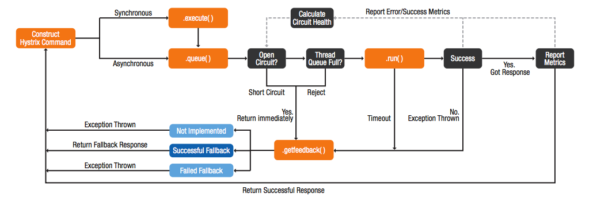

 Netflix在仪表盘里显示熔断器控制的相同数据的状态，为组件状态和信息提供了一个统一的视图而不是针对组件显示常规的错误码信息。
 下图为仪表盘示例

 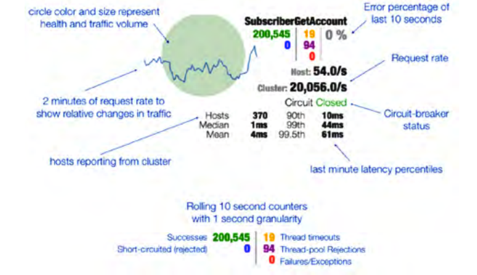

##### 熔断器设计模式要点
  以下是熔断器设计模式里的重要几点([参考]( http://techblog.netflix.com/2012/02/faulttolerance-in-high-volume.html))：

  * 效益
    - 提高故障恢复的能力
    - 使组件故障可见
  * 在哪里使用
    - 为了消除网络延迟或虚拟机实例的故障
    - 防止级连错误蔓延和处理上游复杂的错误信息(故障透明、故障无感知)

#### 请求队列
   请求队列设计模式包含应用程序组件将请求按一个或多个队列排队处理。这些请求被可用的计算节点处理。队列作为请求方与处理服务方的缓冲以避免过载导致服务失败或处理超时。这种模式是生产者与消费者和基于队列的负载调配模式的变种。
    而不是发出所有接收的请求到一个最终端消费，通过队列请求可以负载给最终的消费端盒整个计算集群。如果某个计算节点故障，其它的工作节点将继续处理队列中的请求，这为云感知应用的高可用性提供了容错工作。
    在服务器中运行时，当管理控制服务消耗的资源使用情况时，队列还可以作为一种节流或阻止请求的机制。比如每秒从给定客户端发过来的多个请求数超过一个给定的数后执行拒绝的操作。性能计数器可以在请求排队前就处理。如果客户端的请求超过了云应用的配置阀值，它们将会被阻塞。 阻塞之后，客户端会接受一个429的http错误（太多的请求）和 重试时间。
    图5 微软的队列示例
    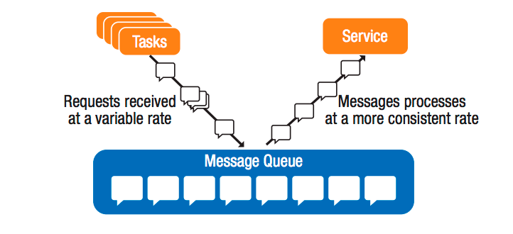

##### 请求队列设计模式要点
   以下是请求队列设计模式里的重要几点([参考](http://www.rabbitmq.com/tutorials/amqp-concepts.html))

   * 效益
     - 提高容错性以确保高可用
     - 提高高并发的APIs性能
   * 在哪里使用
     - 管理应用的故障切换
     - 减少高并发请求APIs负载
     - 通过节流应用备用策略做到自动伸缩

#### 请求打包
   请求打包模式是API请求对应于API响应缓存。在这种设计模式中，对于高并发的API方法的多个相邻的请求被打包为一个请求。例如，显示视频的web应用程序会从视频服务端获取视频的元数据，比如视频长度。在一个常规的应用中，每个用户在访问这个页面时都将导致发起视频元数据的单独请求，如果使用请求打包，那么在给定的时间间隔，多个请求将会打包成一个请求。这不仅降低了API服务端的网络带宽和负载，还使其能够扩展支持大并发的用户请求。
   对于打包请求，在代理的APIs的服务端定一个窗口时间来排队请求，比如:10毫秒.这样队列会周期性的把周期内的请求打包为一个请求发送给APIs服务端处理，然后获取到响应后分发响应到每一个请求者。当然这种只有在非常高并发请求时是合适的。如果在一个窗口时间内只有一个请求，这反倒因为引入了等待时间从而影响应用的性能，一般性来说，窗口的时间应设置为请求的延迟的2倍，比如5ms延迟，设置10ms的窗口时间。
   下图为请求打包的示例
   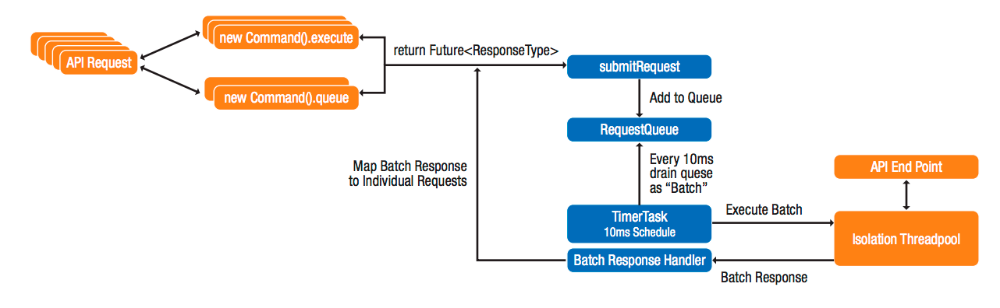

#### 对象改变通知

   按惯例，在一个紧密耦合架构的系统内部各组件之间存在固定的关系，比如某个系统的A和B组件，有这么一个依赖关系，B依赖于A通知它改变其管理的对象。A也知道只有一个B的实例和它的位置，如果B由于某些原因不可见了，A就无法通知到B以及必需要在某些场景下执行的处理机制。A和B之间的依赖就成了单点故障。

   分布式系统有许多这样的依赖，每一个都会降低整个系统的弹性机制，对于这个问题的解决方案就是在架构中引入冗余，把一对一的依赖变成一对多的依赖关系。例如，代替依赖于单一B的，可以把B改变为多示例，这样任一B示例的故障对A的影响都可以忽略不计。
   对象改变通知的设计模式，也被称之为观察者模式，使得这种类型的事件能够被处理，并可以用于提高弹性。

   这种模式中，通知组件(A)实现"可观察"接口、使"观察员"(B)向被观察的组件注册感兴趣的变化。当某些变化在可观察范围时，它将变化情况通知所有观察者。观察员会从通知消息中接收(推模式)变化的详情，或者查询可观察接口或去事件详细(拉模式)。
   在云环境中，这种模式是应用可以弹性伸缩。由于组件不再是紧耦合，额外的示例可以动态地增加系统的处理能力，用于并行计算或I/O密集型任务特别有价值。例如，Netflix的视频必需转换为多个版本，比如不同的设备的分辨率、比特率、不同的带宽等等。使用对象通知模式，当一个新的视频被上传到存储服务器时，代理检测到存储服务的变化，并启动一组转码工作者来分别处理不同的分辨率和带宽需求的转码工作。转码完成后关闭它们。
##### 对象变更通知模式要点

以下是对象改变通知设计模式里的重要几点([参考](https://developers.google.com/storage/docs/object-change-notification))

  * 效益
    - 改进故障恢复能力
    - 增加扩展能力
    - 提高资源有效利用率
  * 哪里使用
    - 并行计算密集型
    - 消除单点故障
    - 降低系统的组件之间耦合度

#### 服务发现

  在分布式系统中，组件于组件之间进行服务调用。发起请求时，组件需要知道这个服务的地址。在传统的多层应用程序中，服务的主机名存储在一个配置文件中，然后使用DNS来查找真实的IP。为了伸缩性支持，IP地址可以参考VIP方案来做负载均衡的部署，对应后端多个服务实例。
  而云环境是高度动态化的，服务的实例和应用的组件会持续不断的加入或退出。对于传统的负载伸缩模型来说，当虚拟机实例、存储、网络的故障发生时，基于DNS的负载均衡模式会把请求重定向到不存在或可预见失败的实例上。解决方案是云服务发现机制，让请求发生时间只有健康的服务实例提供服务，这样的服务发现机制具备如下功能：
   * 为组件提供一种引导请求到可用实例的方法
   * 支持服务实例的动态注册和注销
   * 让每个组件的状态是可管理的
  Netflix实现的服务注册框架"Eureka"拥有这些功能， 以下是它的设计逻辑。
  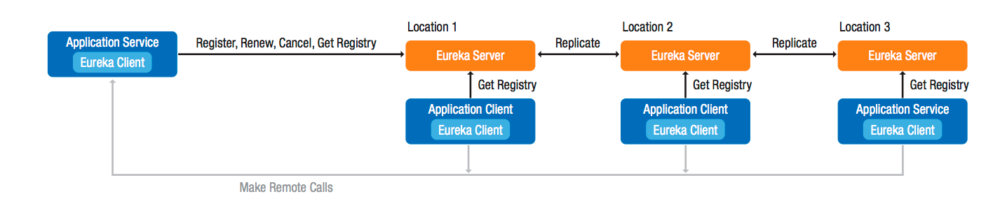

##### 服务发现模式要点

以下是服务发现设计模式里的重要几点([参考](https://github.com/Netflix/eureka/wiki/Eureka-at-a-glance))

  * 效益
    - 改进故障恢复能力
    - 简化基础设施管理
    - 简化动态环境中应用程序的开发
  * 哪里使用
    - 在自动伸缩环境中使用

#### 微服务

  在微服务架构里，一个完整的单体服务会被按功能划分为细粒度的微服务，每个服务一个功能。例如在电子邮件系统中，把单一的消息存储服务分解为单独的服务(新增、修改、删除、读取消息等)，这样，在阅读邮件的功能里面，就可以服用读取消息的服务来提供支持。微服务架构有如下优点:弹性伸缩、高性能、高可靠性和易于部署。

  微服务可以更好支持弹性的原因：因为系统可以按需要横向扩展某个细粒度的服务。比如邮件系统中，如果读取邮件服务超过写邮件的服务需求时，可以仅增加读取的服务实例来处理请求，相对于单体服务来说，没必要复制整个服务来扩展，可以减少资源的浪费。

  微服务可以简化软件更新的开发和部署，开发人员用户一个完整服务的控制权，他可以开发和发布一个独立的服务更新。比如读取邮件的服务开发者，如果改进了读取逻辑并加入缓存机制，它并不需要依赖于其它服务，也不必与他们进行集成就可以单独发布到生产。这样各项功能的开发可以并行进行，开发人员可以根据自己的时间表来安排工作和进度。

  "部署云应用的最好方式是什么？如何编写可重用的代码？怎样才能够快速应对业务的变化？答案似乎就是微服务架构。通过创建单一功能的微服务，并把它做到足够好--减少开销和增加扩展性。这些我们称之为弹性。开发者开发成百上千的小程序，消除深层次的软件共生性(Jim Weirich[Connascence-共生性是被Meilir Page-Jones提出，Jim Weirich在其演讲中有提到它])，结合开发人员的可以重复测试和重构策略可以构建快速响应、可伸缩的云应用
  -- Michael Forhan, AppFirst blog: “Lessons from Distill”  

  Netflix公司已经开发出一种方法来部署微服务更新。采用灰度发布模式，他们先部署一个新版的服务实例而不是全部实例，使用这一个实例进行冒烟测试，如果发现问题，则修复它，其影响性可以忽略不计。如果服务运行正常，则可以小批量的部署新版本以取代旧的版本。对于小批量的新实例还会被实时监控一段时间(以发现是否由内存泄露等问题)，如果有问题，流量会被重定向到没有更新的旧版本实例，下线新版本实例，并修复问题。如果没有问题，则新实例运行一段时间后，停掉旧版本实例。Netflix公司利用持续部署方案来实现这个过程的自动化，从而加快部署速度，能够快速迭代，减少出错机率。 Netflix公司采用了一种简单的理念：在不影响整体服务的情况下，允许可控的失败和实现快速恢复。

  微服务的另一个好处就是出错后，很容易界定错误的范围，因为故障就在微服务的小范围之内。在生产上这就比较好识别错误是由哪些更新导致，并且谁为此负责。

##### 微服务模式要点

  以下是微服务设计模式里的重要几点([参考](http://martinfowler.com/articles/microservices.html))

  * 效益
    - 减少部署更新带来的开销
    - 减少服务之间的边界副作用
    - 弹性实现更新容易
    - 快速定位问题
    - 提高开发人员生产力
  * 哪里使用
    - 在大型系统中，需要弹性伸缩和降低成本
    - 消除单点故障
    - 提高处理性能
    - 需要支持频繁更新的重要系统

#### 无状态服务

   无状态服务是说，服务端不会保存客户端的状态。因此，每个请求必须包含服务需要处理请求所需的全部信息，这种设计模式主要为分布式系统设计时带来如下好处
   * 可靠性
     由于客户端可以简单的重试失败的请求，无需重建和管理请求失败前的状态信息。
   * 可扩展性
     无状态服务从以下几点来改进扩展性：一、服务没有状态，任何实例可以处理来自任何客户端的请求。二、可以随着请求的负载的增加动态的扩展实例，而不影响现有的实例。三、服务端不需要保持状态，可以腾出更多的资源来处理客户端的请求，增加了服务的负载能力。
   * 可见性
     从运维角度来看，增加了服务的可见性。因为每次请求都会有完整的请求信息，所以运维人员可以通过代理等方法，比如APIs管理上，使得请求语义有更有好的可见性。
   * 简单化
     由于服务不存在状态，没有必要在并发请求事务期间管理请求数据或者锁，这使得实现无状态服务更容易，
     服务更容易被调试和预测，消除了特殊巧合状态下触发的缺陷。

   无状态服务的缺点是请求的数据会变的更大，由于服务需要处理请求的状态的信息必须由每个请求提供，而不是缓存在服务器上。但是无状态服务带来的效益会远远大于其缺点。
##### 无状态服务模式要点
   以下是无状态服务设计模式里的重要几点([参考](http://en.wikipedia.org/wiki/Service_statelessness_principle))

   * 效益
     - 提高可靠性
     - 改进扩展性
     - 提高了监控和请求管理的可见性
     - 易于实现
     - 不易发生巧合状态带来的缺陷
   * 哪里使用
     - 任何需要高可扩展性的分布式系统

#### 配置服务
   传统应用的运行时配置通常存在应用程序包中的一个或多个文件。如果设计为热配置模式，那么可以在运行期间对其进行修改；如果设计不为热配置模式，则需要修改后重启应用或重新触发装载配置文件，这个过程会导致停机时间和额外的管理带来的开销。
   通常情况下，这些配置文件在应用程序内部存储和管理，这导致跨节点部署应用程序时会存在文件的冗余存储，随着集群的不断增大，则会增加这些配置管理的开销。

##### 外部配置存储
   让应用程序的配置文件持久化在提供管理云感知应用配置的中央存储库的外部存储中。把配置信息从本地的应用实例中移出，当应用程序之间共享时提供更容易管理和数据控制。这种外部数据存储方式可以随着部署环境的同步而变化。
   数据库或文件系统可以为读写配置文件提供很大的灵活度，对于敏感信息，比如密码等，可以在持续集成的过程中加载或者在运行时使用环境变量注入模式。
   下图是外部配置存储和应用加载过程
   

##### 运行时热配置
   精心设计的云应用应确保高可用的同时尽量减少停机时间，任何需要应用程序重新部署的配置改变都讲增加停机的时间，运行时热配置使得应用在运行时能够感知配置的变化并自动装载配置。
   为支持运行时热配置，需要应用从代码就妥善考虑怎么处理配置变化的通知事件，通常情况下，还是通过观察者模式完成:应用服务器在集中配置服务中注册，并接收任何配置的变更更新。当一个通知事件被触发时，比如，一个新的配置文件被上传，应用程序会先获取最新的配置，然后下载到本地，然后应用读取配置文件，并装载配置在内存中。

   Apache Zookeeper 是 Apache基金会的一个开源项目，它支持运行时的热配置，它提供管理配置信息、命名、分布式同步、服务分组的集中式服务。它可以提供共享的配置服务，也被称作集群协调应用。

   使用Zookeeper的存储配置信息提供两大好处:
  - 新的节点能够获取如何连接Zookeeper的说明，然后可以下载所有的配置信息，并根据配置信息确定他们在集群中的角色。
  - 应用程序可以订阅配置的变化，在运行时允许通过Zookeeper客户端配置和云感知应用程序群集的修改行为来微调配置信息。在集群上运行Zookeeper的模式被称作"合唱",其共享应用数据的状态，参见下图。这种方式允许分布式进程在云感知应用集群内保持协调。
  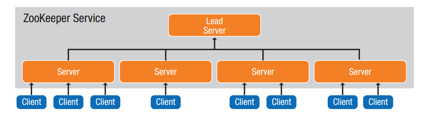
##### 配置服务模式要点
  以下是配置服务设计模式里的重要几点([参考](http://zookeeper.apache.org))

  * 效益
    - 提供单一的、集中存储的配置管理
    - 减少应用配置管理的开销
    - 减少应用停机时间
    - 提高源码缺陷的可见性
    - 提高开发人员生产力
  * 哪里使用
    - 任何需要配置的分布式系统
    - 需要高可用且停机时间少的应用

#### 授权模式
   在云应用中，网络往往是被安全的，因为它不是应用拥有者所能控制的，这就意味着第三方可以在传输过程中拦截和重定向或者窥探数据。另一个风险是在多租户的云环境或者公共网络中，API服务可以被其它租户访问到。这将导致API会成为拒绝服务的攻击目标、让他人访问私有信息，或者提供一种蓄意破坏服务方式。云应用特别容易受到此类攻击，因为他们是由相互依赖的服务且通过网络进行通信的分布式系统。网络依赖和相互调用的api都将增加程序风险，解决方案是加密通信和用授权机制保护api。

##### API授权
  API授权可以确保只有受信任的API的消费者执行API操作。这种方法可以防止恶意访问服务，且支持多个客户端具有不同的访问权限。例如，一些客户可能被授予只读访问该服务，和其他人可能有读写权限。授权还可以用于通过限制哪些客户端能够访问的API以执行架构限制。例如，数据库API可以与访问权限，以确保客户端使用的优选的数据访问服务进行保护。在这种情况下，数据库API将授予只读到数据访问服务/写访问。授权还可以通过限制客户端访问API的方式实施架构体系约束，例如：数据库的API只授权读写权限给数据访问的服务。

  历来应用使用用户名和密码用于客户端－服务端的身份认证。这个方案有两个主要问题：客户端需要存储用户名和密码在本地，这可能会泄漏这些敏感信息导致此种保护机制非常脆弱。在每个组件内部管理用户名和密码还增加了其复杂性、管理的开销和配置出错的风险。

  OAuth 2.0 标准([RFC6749](http://tools.ietf.org/html/rfc6749)) 通过引入基于令牌的访问控制的概念解决了这些问题。在OAuth中，授权服务颁发令牌给客户端达到授权保护资源的特殊访问权限的目的。

  OAuth 服务控制如下图：
   * 客户端通过授权服务器的身份验证并获取服务的访问令牌（1）
   * 授权服务器验证身份验证凭证，如果有效则返回一个访问令牌(2)
   * 客户端需要在每次服务请求时传递访问令牌（5）
   * 每次请求时，服务通过授权服务器检查令牌的有效性(6)
   * 授权服务器提供权限集与令牌关联的查询服务(7)
   * 服务使用权限检查以确定请求操作是否允许，并有条件的执行完操作，然后返回响应数据给客户端(8)

 请求和响应除了需要传递访问令牌外与常规的web服务标准并没有什么不同。注意，访问令牌处于安全的原因是有有效期的。当它到期时，客户端使用刷新令牌请求获取一个新的访问令牌。

  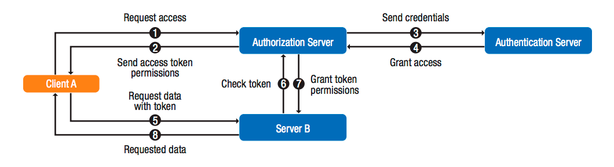
#### 授权模式要点
  以下是授权设计模式里的重要几点([OAuth 2.0 specification](http://tools.ietf.org/html/rfc6749)，[Practices for Secure Development of
  Cloud Applications](http://www.safecode.org/publications/SAFECode_CSA_Cloud_Final1213.pdf))
  * 效益
    - 提高安全性
    - 提供细粒度的访问控制服务
  * 哪里使用
    - 适用于所有客户端－服务端和服务－服务请求模式

### 评估应用程序的云成熟度
云应用成熟度模型提供简单的方式来评估应用程序，与Richardson成熟度模型评估REST API的成熟度一样。在云环境中成熟度模型可以提出意见实现提高应用程序的故障恢复能力、灵活性和可扩展性。

在表2中，成熟度模型有4个级别，3代表最高水平，0代表应用程序不是云感知应用。

|成熟度级别|描述|
|------|------|
|3级自适应|应用程序可以动态的跨基础实施供应商迁移而中断服务  应用程序随着外界的变化可以适当的伸缩|
|2级抽象|服务是无状态的 应用程序对失败的服务无感知，不会受其影响  应用程序对基础设施不敏感，可以运行在任意基础设置中|
|1级松耦合|应用程序由松耦合服务组成  应用程序服务由名字来自动发现 应用程序的计算和存储是分开的 应用程序依赖一个或多个云服务：计算、存储、网络|
|0级虚拟化|应用程序运行在虚拟化的基础架构中 应用程序能够从一个镜像或脚本实例化|

#### 成熟度级别 0: 虚拟化
级别0是最不成熟的级别。此级别应用程序只需运行在虚拟化的计算资源如VM。应用程序从一个保存的镜像活着动态脚本来实例化，比如[puppet](https://puppet.com/),[chef](https://www.chef.io/chef/).此类应用通常是紧耦合的，带有应用程序所有组件之间的显示的依赖。
#### 成熟度级别 1: 松耦合
1级解决了0级松耦合的问题，松散耦合是指组件没有对彼此的依赖，因此，如果一个组件出现故障，其他组件不受影响，应用程序可以继续正常运作。通过启用异步的组件，松耦合还可以很容易的扩展。

#### 成熟度级别 2: 抽象
这个级别介绍可以运行在任何云计算基础架构上的能力，现在面临的挑战是主要的几个云计算平台提供的服务和虚拟机镜像格式是有区别的。这就是限制了其互用性程度，不经修改的应用程序能够跨不同的云提供商运行是罕见的。所以工程师必须云无关的抽象和脚本来使得应用程序可以在任何的虚拟化基础架构上实例化，并提供相同的功能特性。这是重要的额外工作，也是需要注意成本／收益分析的决策。其好处是，应用程序不依赖于特定的供应商的专有接口，不依赖特定的厂商，可以提供运行时的动态服务迁移。

除了基础设施的抽象，在这一级别应用程序应不依赖于特定的服务实例的可用性。因为应用程序使用从网络层重发数据的模式从而与故障的服务之间完全被隔离开。实际上，无论是应用程序还是它的使用者，在应用程序的组件故障时都不应该有任何感知。一种解决方案就是Netflix在亚马逊服务上使用的熔断器设计模式。

最后，由于服务实例可能在任何时候发生故障，当一个服务故障并下线时，必须要有另外的实例起来并且提供服务。所以只有在服务没有任何私有状态、或者存在状态可以被所有服务共享、或者没有任何存储的状态下才能够被实现。

#### 成熟度级别 3: 自适应
此级别表示应用程序已被设计为能够充分利用云环境特性。这一级别的应用程序能够在不中断服务的情况下，无缝的、部分或者全部的从一个云环境迁移到另一个云环境。这就要求它小表现所有前面的成熟度级别。应用程序和服务层迁移的编排职责在于某种叫云"主控程序"的系统，它可以决定何时迁移应用程序以及迁往何处。例如，由于高负载、环境的不稳定或者利用非繁忙时间定价策略，该系统可能选择把应用程序从一个云环境迁移到另外一个。

级别3的应用程序也可以利用云的弹性伸缩能力，当高负载时动态的扩展或者在低活跃期下线部分实例。应用程序可以增加服务实例来水平扩展或者增加虚拟CPUs、内存到已有实例来垂直扩展。这不是应用程序的规则，尽管它需要定义元数据来使得某些代理能够决定使用何种方式来扩展给的服务。

### 运维策略
本节包含云感知应用运维原则的关键点(见表3)。运维原则是指如何部署和运维，其它系统组件如何与之交互。运维策略的焦点为完整系统的整个生命周期内端到端的使用。

Table 3. Operational strategies.

|序号|原则|属性|级别|
|---|---|---|---|
|1|确保冗余|虽然由冗余的节点，但是应用程序也必需设计为能够故障恢复|高|
|2|利用缓存|缓存是用来提高性能、增加弹性伸缩、降低带宽成本|高|
|3|API的访问控制|API端点通过API管理网管保护|高|
|4|分阶段部署|分阶段的更新应用程序的组件以减少部署失败带来的风险|中|
|5|区域或地区的故障应对|应用程序的部署应该适应于灾乱性故障，比如地理区域的故障或地区的故障|中|
|6|减少区域间或地区的延迟|应用程序的部署位置选择应以尽量减少带宽为前提|中|
|7|定位外部高带宽的消费者|高带宽的消费者应托管在云的外部，以减少云带宽的使用成本|中|
|8|抽象依赖关系|API的抽象用来防止绑死专有的云服务|低|

#### 确保冗余
应用程序组件、虚拟机、网络、存储、其它的云基础设施的故障应该能够被预防的，通过冗余设计，这些故障的影响是可控的。例如，云环境跨多个地理区域，整个应用可和它依赖的服务可以在多个地理区域内复制。如果一个地理区域发生故障，流量可以被导向没有问题的地理区域来确保服务的连续性。

#### 利用缓存
缓存是一种广泛应用在传统和云环境的技术。它通过在更接近服务端保持频繁访问数据来提高性能。它也在源系统故障时通过允许其缓存数据可被访问来改进起弹性伸缩能力。在云环境中，缓存减少了网络的流量。如果云服务供应商针对带宽使用收费时它可以降低运维的成本。
此外，在一般的数据策略情况下，[ODCA](https://opendatacenteralliance.org) 建议企业采用IaaS方案。这个方案能够帮助提供一个标准化、安全的方法从所有可用数据中使用正确的格式、正确的时间来创建、管理、交换、提取有意义的信息。
阅读[the Information as a Service Master Usage Model7](https://www.opendatacenteralliance.org/library)探讨实现IaaS的整体信息架构需求以及这一信息架构中哪些方面可以提高大数据、移动应用和云计算技术。
#### API的访问控制
API的访问控制可以确保应用和服务仅被允许的客户端访问。如前所述，没有任何保证能够使的部署在云环境的应用是安全的。一种方案是在API服务的前端加代理管理。但这不仅可以控制访问，还能够审计和统计API的使用情况。Netflix使用这种方法来控制访问其核心的共享服务。通过这种方式，Netflix可以确保只有服务的开发者能够通过服务访问层分发请求。

#### 分阶段部署
在大型分布式系统中，由于bug、边界影响性、无法预料的不兼容性可能导致软件更新的异常情况发生。而且随着系统的变大、动态化和复杂性的提高，预测和预防这类情况的能力会下降。敏捷开发的实践中，从不同团队发起的小和更加频繁的更新成为常态，也会导致这类风险的增加。
风险管理的一种方法是为新版本发起一个小规模且能够全程可监控的部署更新。新旧版本同时并行，减少部署导致下线整个系统可能性。如果小规模部署成功，可以使用一个更大范围的实例更新，保留旧的版本来作为故障切换的节点。如果新版本部署失败，请求可以很容易的导向旧版本实例。如果新版本操作成功，旧版本的实例则可以关闭和回收。

#### 准备分区(zone)或地区（region）的故障应急预案
对云资源使用分区管理，保证分区的独立性和隔离性。亚马逊利用地理地区组织其EC2环境，每个地理地区的云包含多个可用的分区。亚马逊云服务的中断历史表明，中断可能影响整个地区或者整个分区。因此，规划设计云的部署环境时，考虑地区或分区的故障弹性是至关重要的。例如，Netflix把所有服务冗余部署进多个地区的云环境，如果一个地区环境发生故障，另一个地区可以接管其服务。当然，这就需要跨地区的数据复制和同步支持。

应用程序在多个可用的分区环境中可以使用主／备或者主/主模式部署。在主／备模式下，一个应用程序被同时部署进IaaS或PaaS提供的两个不同的位置或者可用分区。这两个位置都可以运行该应用的实例，但是在同一时间只有一个位置是活动的。本地负载负载均衡处理本地应用实例，全局的负载均衡通过健康检查决定终端用户的请求发向何处。

在主／主模式下，一个应用程序也是被同时部署进两个位置，但他们都是活动的，同时运行并处理不同的用户，发生故障时会转移服务到彼此。如果一个地区发生故障，全局负载平衡帮助通过剩余的位置重新负载。云资源的主／主模式的优势是提高云资源的利用率，通过多个活动位置提供更能力的选择贴近用户位置的可用服务的能力。

#### 尽量减少内部分区／地区的延迟
如果云环境在地理位置上是分散在长距离或者跨数据中心的分区架构，网络延迟成为考虑一个因素。

对于需要低延迟的服务，应根实际据情况把他们尽量部署在同一地区(region)且尽可能同一分区（zone），在云中部署应用的其中一个挑战是物理架构是不透明的，不同于数据中心可以要求服务部署在相同的物理机架。可以通过谨慎的分析提供一些云内部架构的视角，但要注意，这可能随着时间的变化变的不可控制。

#### 确定高带宽的外部消费者
考虑数据应该被存储在哪里来减少数据的传输费用。例如，亚马逊把EC2到公共互联网的数据传输做了计费统计。存在这一特性的应用花费将会变多。但是从云的外部定位数据如CDN，可以节省很多的费用。

#### 抽象依赖
避免创建客户端和服务端的静态依赖。例如，一个应用可能依赖一个存储服务。随着时间的推移存储服务的接口、实现和位置都可能变化。例如，应用程序可能会迁移到有同等服务不同接口、不同地址的不通云提供商。API管理能够通过抽象基础服务和客户端实现之间的访问并暴露一个REST API。这种松耦合方式可以让组件彼此相对独立的发展。

## 结论

随着技术的迅速发展，开发人员需要不断的提高技能，提炼、采用新技术来架构、设计、开发和支持强大的云应用。要成功的利用云的能力，企业需要做到以下几点：
* 在培训上投入，确保他们的员工具备构建云应用的能力
* 找出释放开发人员花在简单、低层次、低价值上的工作时间的方法
* 提供大规模可伸缩的复杂程序，而且可以通过简单修改就能把它集成进现有的系统中

### 对开发者的建议
开发人员要利用云的特性，通常采用与分布式系统相关的原则来架构设计应用。这些原则帮助云应用弹性、无缝处理基础设施故障、高效和最优的利用云资源。

本文概述的原则解决了分布式系统的内在挑战。已经在大规模的云应用证明是成功的设计模式被提供给开发人员架构设计他们的应用程序。毫无疑问，随着开发人员学习如何有效的利用云环境，并优雅的处理此环境下特有新的、意料之外的挑战的同时，一种新的设计模式即将诞生。

云应用的成熟度模型位开发人员提供来衡量他们的应用的云成熟度标准方法。这可以用来作为路线图，用于确定云应用发展路程中应该关注哪些内容。

### 云平台需求
以下要求适用于任何云计算提供商：
* 支持云计算的行业标准，最好是开放的标准和广泛支持的事实标准。这种支持将不会让你绑死在某一个供应商或专有的API之上，是应用能够在混合云无缝运行的先决条件。
* 提供与其它云计算平台提供的统一标准的虚拟机镜像。例如，如果是开发一种私有云，且要求与Amazon之间可以一致性的移植应用，考虑创建匹配由Amazon EC2提供的镜像。
* 支持数据亲和力(使用消费者／生产者的数据调用方式)
* 使用标准的版本控制脚本来创建自定义的虚拟机配置

我们通过云技术预示着重大的为开发人员和企业促进真正的分布式技术世界的技术转型，技术人员有机会通过采用新的方法和技术，以满足云感知应用开发提供业务转型和实现真正的价值。ODCA希望本文作为云内新应用程序体系结构研究和应用的起点。ODCA相信提升应用开发技能，满足应用不断增长的需求和充分利用云特性，需要继续教育和培训，持续专注于开发技能、进化发展、创新。

## 参考

* “Architectural Patterns for High Availability”
https://www.infoq.com/presentations/Netflix-Architecture
* Cloud Architecture Patterns
https://www.amazon.com/Cloud-Architecture-Patterns-Using-Microsoft-ebook/dp/B009G8PYY4?ie=UTF8&*Version*=1&*entries*=0
*  “Cloud Characteristics, Principles and Design Patterns”
http://www.gartner.com/document/2081915
* “Cloud Design Patterns: Prescriptive Architecture Guidance for Cloud Applications”  
http://msdn.microsoft.com/en-us/library/dn568099.aspx
* “Building Cloud-Aware Applications”
http://www.slideshare.net/cobiacomm/building-cloudaware-applications [slides 17, 18, 19, 31]
* “Searching for Cloud Architecture...”
http://blog.cobia.net/cobiacomm/2011/11/25/searching-for-cloud-architecture/
* “Maximizing Cloud Advantages through Cloud-Aware Applications”
http://www.intel.com/content/dam/www/public/us/en/documents/white-papers/maximizing-cloud-advantages-through-cloud-aware-applications-paper.pdf   [page 6]
* Network Latency between U.S. cities (AT&T)
http://ipnetwork.bgtmo.ip.att.net/pws/network_delay.html
* “The Fallacies of Distributed Computing Reborn: The Cloud Era – New Relic blog”
http://blog.newrelic.com/2011/01/06/the-fallacies-of-distributed-computing-reborn-the-cloud-era/
* “5 Lessons We’ve Learned Using AWS” – Netflix Tech Blog
http://techblog.netflix.com/2010/12/5-lessons-weve-learned-using-aws.html
* “Optimizing the Netflix API” – Ben Christensen
http://benjchristensen.com/2013/04/30/optimizing-the-netflix-api/
* “Architecting Applications for the Cloud: Best Practices” – Jinesh Varia, Amazon Technical Evangelist
http://media.amazonwebservices.com/AWS_Cloud_Best_Practices.pdf
* “Lessons from Distill” – Michael Forhan, AppFirst
http://www.appfirst.com/blog/lessons-from-distill/
* “Understanding Security with Patterns” – Prof. Peter Sommerlad, Tutorial T39 @ OOPSLA 2006
http://wiki.hsr.ch/PeterSommerlad/files/T39-Sommerlad.pdf
* “How it Works” (Circuit Breaker implementation in Hysterix open source library) – Netflix
https://github.com/Netflix/Hystrix/wiki/How-it-Works
* Netflix Shares Cloud Load Balancing and Failover Tool: Eureka! - Netflix Tech Blog
http://techblog.netflix.com/2012/09/eureka.html
* “Dystopia as a Service” – Adrian Cockcroft, Netflix
http://www.slideshare.net/adrianco/dystopia-as-a-service
* “Netflix and Open Source”
http://www.eiseverywhere.com/file_uploads/c6b285b64a18cc2742c0fb20061d6530_OBC_BreakoutSession_AdrianCockcroft_1pm.pdf

## 附录A: 术语

|术语|定义|
|---|---|
|Agent-Based|是指基于代理的云计算，使用软件代理促进云服务的传递的计算形式，这些代理可以是私有的API或开放的API|
|Agentless|是指使用标准编程接口（开放API）来发现其中的远程API由云服务或云提供商和云代理之间运行的通信网络的直接分析暴露了云服务。|
|Application program interface (API)|描述一组构建软件应用程序的工作，协议和工具。一个设计良好的API，可以更容易地提供应用的模块化开发。程序员使用模块来构建应用程序。大多数的工作环境，如Microsoft Windows，提供API让程序员编写与操作环境保持一致的应用程序。|
|Cloud application|云应用(有时也叫云APP)是一种软件和相关数据托管在云上的应用，有一些原生桌面应用和纯粹的web应用的特性|
|Cloud consumer|与云供应商从事，无论是云经纪人或通过与云供应商的直接参与的接收云服务的个人或组织。|
|Data store|数据存储，通指所有的数据存储，包含文件、数据库、文本等等。|
|Hybrid cloud|混合云：云基础设施由2个以上的不同云基础设施构成的单一实体，通过标准化或专有技术使得数据、应用在其之上可以移植(例如，云之间的负载均衡的集中云)。|
|Infrastructure as a service (IaaS)|基础设施即服务：为消费者提供计算、存储、网络以及其它基本计算资源，且让消费者能够部署和运行任意软件(包含操作系统、应用软件等)的能力。消费者不需要管理或控制底层的云基础设施，仅需要控制之上的操作系统、存储和部署的应用。这些控制有时依赖于网络组件(比如主机防火墙)|
|Multitenancy|多租户是指服务于多个组织(租户)的单个实例的软件架构原则。多租户与多实例隔离的架构(某类用户访问特定的实例)有鲜明的对比。随着多租户架构的流行，应用软件把它的数据和配置设计为虚拟的分区隔离，每个组织(租户)使用自定义的虚拟应用|
|Multi-tier architecture|在软件工程中，多层体系结构是指客户端－服务端体系结构，应用处理和数据管理功能在逻辑上被分开。最广泛的多层架构是三层架构。|
|OAuth|OAuth是一个认证协议，它允许用户不需要共享认证凭据(用户名／密码)就能够申请应用的角色认证|
|Platform as a service (PaaS)|平台即服务：为消费者提供能够部署其通过平台支持的编程语言、类库、服务和工具创建或获取的应用。消费者不管理或控制底层的云基础架构，包括网络，服务器，操作系统或存储，但拥有对部署的应用程序，并可能配置设置应用程序的托管环境的控制。|
|Private cloud|云基础设施仅有单一组织的多个业务单位专用，它可能由这个组织或第三方以及它们的组合形成来拥有、管理和运维，其处所可能有也可能没有|
|Public cloud|云基础设施为开放的公众使用的一种形式。它可能由企业、学术会、政府组织以及它们的组成形式来拥有、管理和运维，其云供应商处所是存在的|
|Representational state transfer (REST)|一种软件架构风格，设计风格而不是标准，只是提供了一组设计原则和约束条件。它主要用于客户端和服务器交互类的软件。基于这个风格设计的软件可以更简洁，更有层次，更易于实现缓存等机制。Web 应用程序最重要的 REST 原则是，客户端和服务器之间的交互在请求之间是无状态的。从客户端到服务器的每个请求都必须包含理解请求所必需的信息。如果服务器在请求之间的任何时间点重启，客户端不会得到通知。此外，无状态请求可以由任何可用服务器回答，这十分适合云计算之类的环境。客户端可以缓存数据以改进性能。在服务器端，应用程序状态和功能可以分为各种资源。资源是一个有趣的概念实体，它向客户端公开。资源的例子有：应用程序对象、数据库记录、算法等等。每个资源都使用 URI (Universal Resource Identifier) 得到一个唯一的地址。所有资源都共享统一的接口，以便在客户端和服务器之间传输状态。使用的是标准的 HTTP 方法，比如 GET、PUT、POST 和 DELETE。|
|Software as a service (SaaS)|软件即服务：消费者可以直接使用基础设施上提供的运行的应用程序功能。应用可以被各种客户端访问(web浏览器、程序接口等)。消费者不需要管理或控制底层的云基础设施，包含网络、服务器、操作系统、存储、甚至某些应用软件的功能，除了需要有限的用户应用需要特定的配置设置。|
|Solution provider|技术厂商出售其技术能力，能够用于构建云或其它服务，通常专注于一个特定的软件产品，特殊的硬件产品或者提供咨询服务的企业|

## 附录B: 云反模式
云反模式－－应该避免阻止应用程序在云中运行的特定设计实验。并非所有的设计模式都是与云感知应用相关和有️帮助的。在下列表中就是云感知应用设计的反模式：
* 复杂的配置
  避免不必要的困难和冗长的配置设置。如果不需要热配置和动态加载文件，则可以使用固定的配置设置。如果在持续集成的环境中保存配置设置，这些配置可以在构建应用时访问或加载。这种方法可以避免在配置服务器上放置一个不必要的信息。一旦部署，由于云应用过多的请求来跨节点集群的检索配置设置可能会无意中导致拒绝服务的情况。
* 复杂的依赖关系
  避免不必要的应用程序内的类库依赖。在大规模部署的环境下这些依赖关系会导致需要较长时间的程序链接、装载、或者回溯各种组件。为了最大限度的减少依赖性，使用工具显示现存的依赖关系，让开发者只保留哪些必要的依赖组件。
* 管理共享状态
  避免在应用启动时检索其状态，这样会造成应用程序处理请求的延迟。尽在需要时依赖懒初始化的获取状态，而不是无条件的在应用启动时就这么干。
## 附录C: 安全访问控制
访问控制技术为获取应用访问权限提供了可配置的机制。特定的设计模式可以应用到跨云感知组件的访问控制。无论基于角色的访问控制(RBAC)和基于属性的访问控制(ABAC)提供系统级的授权。

RBAC也称为“基于角色的安全。” RBAC模型定义了指定权限级别的角色。每个角色分配一个授权的权限，决定与角色相关联的安全级别许可授权（例如，访问计算资源以执行一个特定的功能）。反过来，这个角色和权限分配给一个或多个主题。一个主题可以是一个人或自主代理（如创建和部署计算资源的自动配置服务）。

ABAC也称为“基于属性的安全。”该ABAC模型是一个相对较新的范例，结合主题，策略和属性来定义逻辑访问控制。此逻辑定义可以让用户简单地定义一个复杂的访问控制策略。相反地​​，RBAC依靠手动更新基于主题当前状态和相应角色的策略（例如，工作角色或职责）。

## 附录D: 自动伸缩
自动伸缩控制动态的伸缩计算的资源(扩／缩)以满足当前需求。伸缩依赖于可能发生在已部署的应用程序中或更低级别的系统层。给监控的属性定义一个最大或者最低的阀值(CPU使用率消息队列大小等)。当用于云应用的给定负载太高或太低，超过了预期的阀值时，发出警报触发来为集群增／减节点。

许多商业和开源软件解决方案在Iaas和PaaS的平台级提供自动伸缩。应用在这个级别集成和自动化水平因解决方案而有所不同。自动伸缩的解决方案当前示例如下：

* Amazon Auto Scaling http://aws.amazon.com/cn/autoscaling/
* Azure Management Portal Scaler
* Rackspace Auto Scale
* Scalr
* Eucalyptus Auto Scaling
* RightScale Auto Scaling

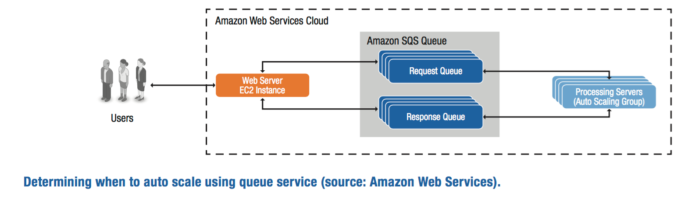

## 附录E: CAP 理论
由 Eric Brewer 声明的 CAP 理论指出在一个分布式系统中不能同时满足以下三个期望的性质:
* C 一致性 无伦从分布式系统的哪个节点读取的数据都是一样的
* A 可用性 读取和写入总是成功的
* P 分区容错性 系统不会因某个消息的丢失或组件的故障导致其终端

当实现一个BASE（基本可用，软状态，最终一致性）云感知应用程序中的数据存储，权衡存在影响的可扩展性，性能和可靠性。Brewer描述了这些性质并说明仅可以满足其中的两个，则可行的设计方案为：CP，AP和CA.
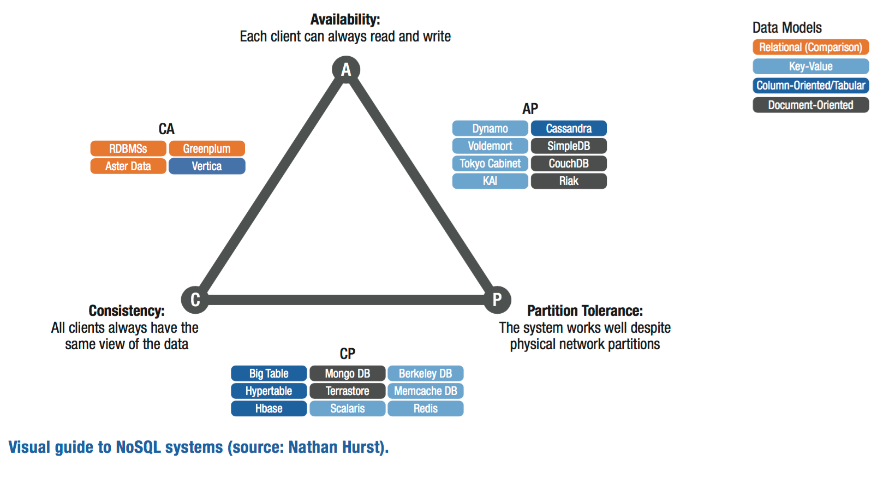

## 附录F: 数据库分区
数据分片是一个设计原则，定义数据库表纪录级别的横向分区。每个分区为一个共享的碎片，可以横跨分布服务器的多个节点。因为存在数据库表的行数减少，所以即可以提高数据库性能也能提高伸缩性。数据分片也提高了吞吐量和数据库的整体性能。也增加了数据库的存储容量。

术语 分片 来源于google的一篇论文。Bigtable: A Distributed Storage System for Structured Data。

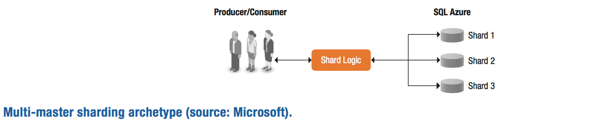

## 附录G: 数据复制
数据复制涉及到创建和管理的数据存储区的重复版本。复制的数据可以确保冗余资源之间的一致性。复制可以提高系统在数据源访问失败和不能访问时的的可靠性、 容错能力和可访问性。如果数据源失败，云感知的应用程序可以无缝地切换到辅助数据源，确保一致性和可用性。这提高了容错能力，增强了可用性和云应用程序的响应能力。

有多种复制模型，每个都有不同的方法来提供持久性数据存储 （例如，通过一个数据库、 磁盘存储或文件）。

## 附录H: 静态内容托管
Web 应用程序通常在处理动态页的请求时也提供静态内容。处理客户端能够下载静态内容的请求会消耗大量的计算资源，降低了应用程序的效率。云感知的应用程序依赖于静态内容托管减少这种成本转嫁到隔离资源的静态内容托管服务器。

内容传送网络 (CDN) 可以提供地理位置分散的存储和服务功能的静态内容。当从应用程序中移除静态内容托管时，可以腾出更多资源处理服务请求以提高吞吐量。选择在物理位置接近 CDN 服务内容的方式可以减少客户的请求的延迟。总体而言，页面呈现和内容服务的客户端的性能可以提高而云感知应用程序的吞吐量。
