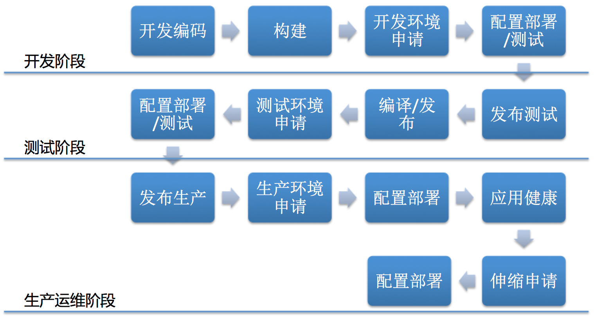

# PaaS平台分析

**linxuhua:** (hualee215 AT gmail.com)

## 一、什么是PaaS平台
PaaS(Platform as a Service)是将基础网络设施和计算资源的硬件和应用基础架构（Middleware）以服务的形式提供给用户,PaaS免去了用户搭建硬件网络和开发、运行新应用程所需的软件基础架构投入,为企业简化流程应用的交付、运行和维护提供端到端的完整支持。PaaS为了简化软件的交付并平台化，把应用的运行环境进行统一和固化，只不过从第一代的单语言框架支持，演化为现在的多语言多框架的支持；环境统一的打包方式从特定模式(javapack)演化为现在几乎通用的docker image的模式。可以说PaaS平台依赖于运行环境打包交互的大前提。

Gartner把PaaS分为两类，一类为应用平台即服务APaaS(Application Platform as a Service)，一类为集成平台即服务IPaaS(Integration Platform as a Service)，IPaaS架构在APaaS之上。我们通常说所得PaaS为APaaS，目前大部分企业也主要聚焦在这部分。APaaS主要面向技术方面的支持，IPaaS面向业务方面的支持。

  - APaaS

    * 应用开发
    * 应用元数据管理
    * 数据存储(多种类型)
    * 应用构建(CI)
    * 应用交付(CD)
    * 分布式运行环境/部署(部署架构编排)
    * 应用监控/计量
    * 动态伸缩
    * 应用运维/升级

  - IPaaS

    * 外部业务集成(比如合作伙伴等)
    * 业务监控
    * 业务编排(服务编排)
    * 数据转换、传输等
    * 流程编排(流程引擎)

对比以上列出的功能点，IPaaS相对于APaaS来说相对理想，APaaS更贴合实际情况和企业能够实现的场景。本文主要就PaaS(仅包含APaaS部分)在企业内部如何落地探讨出一套方法论，帮助企业能够理解PaaS，以及其如何帮助企业改进其研发管理、产品交付及管理提供端到端的支持。

## 二、PaaS如何影响IT企业
按照PaaS的定义，其影响IT企业的开发、测试、交付、运维、管理等各个环节，把IT企业的各个环节列出，对比起来看PaaS如何介入这些环节中。如下图，一般IT企业包含大致如下一些环节，根据团队的天然合作模式，把其分为三个阶段：开发阶段、测试阶段、生产运维阶段。下面将分析PaaS如何提供一站式服务来为IT企业提供这三个阶段的端到端的服务。方便理解，从本单位方案、传统方案、PaaS方案三个方面来对这三个阶段进行分析比对。

### 开发阶段

||开发编码|构建|开发环境申请|配置部署/测试|
|----|-------|---|---------|------------|
|本单位方案|开发自主|基本人工|人工分配／配置|应用人工安装配置／测试|
|传统方案|开发自主(对应用有基本的定义规范)|自动化构建平台|平台申请／人工分配／模版配置|应用自动部署平台／测试|
|PaaS方案|开发自主(入口需定义应用元数据信息，此信息一直伴随应用整个生命周期)|无缝对接自动构建|无缝对接IaaS平台的资源申请，并使用标准化的打包运行环境，在应用元数据中定义其环境信息|包含应用元数据信息的自动部署模块／测试|

传统方案中做到极致也就相当于PaaS方案了，只不过传统方案中各个环境的支撑平台相对独立，没有整合在一起，比如版本管理库、自动构建、资源管理平台、自动部署平台等自成一套，它们之间往往以特定接口或者人工对接。而PaaS方案把这些平台的功能整合在了一起，并使用应用元数据把它们无缝串联在一起协作。这样就对IT的各个环境的人员(开发、测试、管理、运维等)提供端到端的支持服务。

### 测试阶段

||发布测试|编译／发布|测试环境申请|配置部署/测试|
|----|-------|---|---------|------------|
|本单位方案|开发打tag提交bugzilla|基本人工|人工分配／配置|应用人工安装配置／测试|
|传统方案|开发打tag发布版本|自动化构建平台|平台申请／人工分配／模版配置|应用自动部署平台／测试|
|PaaS方案|开发打tag发布版本|无缝对接自动构建|无缝对接IaaS平台的资源申请，并使用标准化的打包运行环境，在应用元数据中定义其环境信息|包含应用元数据信息的自动部署模块／测试|

测试阶段于开发阶段很像，一般在互联网类企业会把开发和测试放在一个产品型团队，产品的质量由整个团队负责，而没有把这两个阶段割裂开来。在这三个方案里面里 ，开发／测试阶段的入口都为源码(程序的源码版本库为纽带；传统包含简陋元数据、PaaS包含完整元数据)，如果把这两个阶段完全割裂开，在传统方案案看来，只不过是重复的工作，在定义应用元数据时只需区分开发和测试即可在一个共用的平台里对同一产品进行开发和测试的工作。

### 生产运维阶段

||发布生产|生产环境申请|配置部署|应用健康|伸缩申请|配置部署|
|----|---|---|---|-----|---|-----|
|本单位方案|CM发布应用目标版本到FTP服务器|提交部署架构需求／人工分配资源|人工配置／部署应用|监控平台/日志人工查询|根据需求提伸缩资源申请／人工分配资源／提交伸缩方案|人工配置／实施伸缩|
|传统方案|CM发布应用目标版本到版本库|提交部署架构需求／人工分配资源／根据应用要求初始化运行环境|自动部署平台推送应用到目标环境，上线应用|统一监控(全方位)／统一日志平台|提交部署架构需求／人工分配资源／根据应用要求初始化运行环境|自动部署平台推送应用到目标环境，上线应用|
|PaaS方案|CM发布应用目标版本到版本库|填写应用生产的元数据信息(部署信息、关系、配置文件、伸缩规则等等)|调度器根据元数据自动部署应用|结合应用元数据的统一全方位监控／统一日志查询模块|包含应用元数据信息的自动部署模块／测试|调度器根据监控数据和伸缩规则自动化对应用进行弹性伸缩操作|

对于生产运维来说，应用的健康是至关重要的。当然不仅只有生产运维有应用的健康阶段，开发和测试也有，同样的功能模块一样可以应用在开发和测试阶段，只不过在开发测试阶段没有显示的表明。而在生产环境中，PaaS整合了传统方案的自动部署平台、监控平台、日志平台、应用版本仓库，PaaS为了进一步快速的响应需求，把应用的运行环境从模版化改为容器化并与应用打包在一起交付的方式。从而达到了更快速的应用部署及启动来响应需求。

### PaaS功能梳理

通过以上的比较，可以形象的理解PaaS平台，结合业界的方案、开源产品简单梳理其功能包含以下几点

* 应用元数据管理

    需开发，其为各种平台对接整合的纽带，PaaS平台根据其提供的功能有多种元数据的提供方式。
    - 整合CI/CD 元数据在开发阶段定义，包含应用源码库、应用配置、部署架构等信息
    - 仅包含CD 元数据在测试和生产部署时定义，包含应用的目标码(或者容器镜像)、应用配置、部署架构等信息
* 应用源码版本库(可选集成)

    做到CI的PaaS平台需要，为应用持续构建提供支持；开源:git等
* CI支持(可选集成)

    自动构建工具集成，通过应用元数据进行对接；开源:jenkins、仓库等
* CD支持

    利用应用元数据能够对应用进行持续的部署交付，可以做到源码、目标码、带运行环境的镜像混合的交付模式，可以实现蓝绿部署、灰度发布等功能。开源：PaaS平台自身支持

* 应用运行环境的打包(可选集成)

    带运行环境的产品交付方式，通用采用docker，可以自定义或其它； 开源: docker及仓库 garden等
* 应用配置的服务化

   应用配置从配置中心获取，不能有人工干预，也不能让应用有停机时间，所以要求应用的相关配置应做到自动从配置中心获取自己的配置数据，并能做到热配置(当配置有更新时，应用能自动刷新配置信息而不用重启服务)，这样在调度平台中，平台可以很快能够对应用的容器实例进行伸缩的操作，而不需要依赖人工干预、停机时间　开源：　360configServer zk等等
* 服务的发现及自注册

    应能够自动注册、发现服务，而不是通过硬编码配置；弹性伸缩完成后需要加入到生产系统的业务链条中，能够让业务请求分发到新增的节点，并且对服务的调用上下层保持透明，此时需要有服务的自动注册与发现机制来保证。开源: haproxy 等

* 资源的抽象及管理

    对物理资源的抽象及调度，可以统一的池化管理；开源：mesos swarm kubernetes cloudfoundry等
* 应用调度(自动部署)

    由于容器化后，运行环境与应用一起交付，所以无需部署平台，只需调度容器即可。根据元数据对应用(带运行环境的打包整体)的调度，一般与资源的抽象及管理层融合在一起，开源 mesos->marathon swarm->swarm kubernetes-> kubernetes cloudfoundry->cloudfoundry

* 应用编排
　　在分布式系统里(特别是针对微服务化的容器应用)，各独立服务之间有调用关系，编排服务可以帮助开发者和运维人员创建并管理可移植的分布式应用。开源: swarm-> compose kubernetes-> pod mesos　无
　
* 监控

    主机监控、容器的监控、应用监控、业务监控等各项监控结合应用元数据信息进行整合，并为调度、伸缩模块提供数据支撑。 开源: zabbix nagios
* 日志

    分布式系统的日志归集和分析由专有平台来处理，PaaS可以整合这些开源平台来处理其上分布式系统的日志查询和分析的工作。开源: ELK(Elastic + Logstash + Kibana) EFK(Elastic + Fluentd + Kibana)
* 弹性伸缩策略引擎

    根据应用元数据配置的规则，弹性引擎需要实时获取监控的数据并根据规则匹配，如果匹配上则按照规则触发弹性伸缩的动作。无开源

## 三、方案介绍

### 支持成熟度

从以上列出的功能点对三个方案列出表格，看其对PaaS功能的支持成熟度

|方案|应用元数据管理|应用源码版本库/可选|CI支持|CD支持|应用运行环境的打包/可选|应用配置的服务化|服务的发现及自注册|资源的抽象及管理|应用调度/自动部署|应用编排|监控|日志|弹性伸缩策略引擎|
|--------|--------|--------|-------|--------|--------|--------|-------|--------|-------|--------|-------|--------|--------|
|openshift(redhat/kubernetes)|支持|支持|支持|支持|支持|不包含(与应用结合紧密)|支持(Service:应用、Haproxy:集群)|支持|支持|支持kubernetes|监控|EFK|结合业务指标需定制|
|swarm|支持|简单支持(可以与自动构建平台对接)|支持|支持|支持|不包含(与应用结合紧密)|支持(Haproxy)|支持|支持|支持compose|监控|可以对接类ELK系统|结合业务指标需定制,很简陋|
|mesos|支持|不支持|不支持|支持|不支持(采用运行环境容器化，上传应用包方式)|不包含(与应用结合紧密)|支持(Haproxy)|支持|支持|不支持|监控|可以对接类ELK系统|结合业务指标需定制|
|blumix(ibm/cloudfoundry)|支持|支持(完整链条，支持定制构建流程)|支持|支持|都支持|包含，需要按照其规则使用|支持(Haproxy)|支持|支持|支持，特定方式|监控|集成类ELK系统|结合业务指标需定制|

###　开源产品列表

三个方案都使用开源产品二次开发的，从两个方面来看其开源产品的组成。一、自身架构开源产。二、支持其它服务的对接开源产品。

### 自身架构开源产品

|方案|资源的抽象及管理|分布式系统协调组件|应用编排|应用调度／自动部署|服务的注册发现、软负载|镜像仓库|监控组件|弹性伸缩策略引擎|多主模式自身访问的HA实现|
|----|---|---|---|-----|---|-----|-----|-----|-----|
|openshift(redhat/kubernetes)|kubernetes|etcd|kubernetes:pod|kubernetes|kubernetes|registry|cadvisor收集，Heapster汇总|kubernetes|haproxy|
|swarm|swarm|etcd|compose|swarm|confd+interlock+haproxy|registry|自定义脚本+docker api|厂商开发|haproxy|
|mesos|mesos|zookeeper|无|marathon|bamboo+zookeeper+haproxy|registry|自定义脚本+docker api|厂商开发|haproxy|
|blumix(ibm/cloudfoundry)|cloudfoundry|商业|商业|商业|商业|商业|商业|商业|

### 对接外部开源产品

|方案|应用元数据管理|源码版本库|CI支持|CD支持|应用环境的打包|应用配置服务化|应用监控|统一日志|
|----|---|---|---|-----|---|-----|-----|-----|
|openshift(redhat/kubernetes)|kubernetes需二次开发|git/gitlab|jenkins|kubernetes需二次开发|docker|360configServer/zk等需自己引入并二次开发对接|(zabbix/nagios/statd+opentsdb+grafana)需要对接开发|ELK(Elastic + Logstash + Kibana)/EFK(Elastic + Fluentd + Kibana)对接需二次开发|
|swarm|swarm需二次开发|git/gitlab|厂商自研，可对接jenkins,需要二次开发|swarm需二次开发|docker|360configServer/zk等需自己引入并二次开发对接|(zabbix/nagios/statd+opentsdb+grafana)需要对接开发|ELK(Elastic + Logstash + Kibana)/EFK(Elastic + Fluentd + Kibana)需二次开发|
|mesos|mesos需二次开发|git/gitlab|无,jenkins对接需二次开发|marathon需二次开发|docker|360configServer/zk等需自己引入并二次开发对接|(zabbix/nagios/statd+opentsdb+grafana)需要对接开发|ELK(Elastic + Logstash + Kibana)/EFK(Elastic + Fluentd + Kibana)需二次开发|
|blumix(ibm/cloudfoundry)|cloudfoundry|商业|商业|商业|商业|商业|商业|商业|

### 产品特性

 　PaaS平台本身就是一个分布式系统，使用SaaS的方式提交给开发、测试、运维人员进行使用；除了CI/CD的支持外，最终极的功能就是对应用的自动弹性支持，以下针对几个方案的特性进行详细说明

#### kubernetes(openshift)方案

 Google对微服务架构部署的成套解决方案，自成体系的管理工具，有服务发现和复制.能够很好的支撑微服务分布式应用架构的部署和运维。单一集群300node上限 一个node可以达到稳定可靠运行的100个容器，测试能达到300个容器

* 优点

  Google对微服务架构部署的成套解决方案，自成体系的管理工具，有服务发现和复制,不绑定到docker特定的容器方式

* 缺点

  Google的容器经验的总结，是其自身方式和经验的落地，使用它必须按照它的方式去做事情;必须二次开发使用,生产成熟度低，集群规模有限制
　　　

#### swarm方案
  docker的原生支持方案，针对单体应用的弹性测试，对单体应用支持不是很好，不过可以变通和改造后支持稍微复杂的单体应用的伸缩。如果复杂的单体应用则完全无法适用。

* 优点

  完全基于docker的实现(有新版本在着手抽象，不与docker绑定)，docker的新功能可以马上适配并使用
  　　
* 缺点

  不成熟，还在发展中；
  目前还不是很稳定。无法支持大规模集群
  　　

#### mesos方案

   比较早的解决方案，由于其简单可以管理超大规模集群，目前国外大厂都已生产投产，而且规模很大。针对单体应用的弹性测试，对单体应用支持不行，必须改造应用为微服务化后适应其平台。

* 优点

  作为资源调度和管理框架，mesos是最自由的PaaS平台方案，其可以进行充分的自定义实现自己的需求
  成熟的资源管理框架，可以支持大规模的集群调度

* 缺点

  简陋，缺少很多东西，需要大量的整合和自研,二次开发难度大

#### cloudfoundry(IBM/blumix)方案

　PaaS的先行者，很多方案原始创作者，由于其封闭和独特的模式，导致与企业对接起来很困难，企业接受度低。由于只能使用IBM的公有云进行测试，所以只能针对微服务应用的弹性测试，属于PaaS的完整实现，达到流程可定制的程度。

  * 优点

  PaaS方案的先行者，完整实现了PaaS的所有功能
　　　  
  * 缺点

　　　特定的容器化方案，没有普遍性

### 互联网案例

　参考了一些互联网的案例，下面列出的仅仅了解到的信息，没有列出的为不了解部分。就了解情况来说互联网企业也没有做到微服务化，大部分都采用了容器当虚拟使用的方案。分析下来其面对的也是大量的单体遗留系统问题，无法完全做到微服务化的部署和管理。

  * 携程　

  仅做CD,没有包含CI,把容器当虚机使用(有固定IP)。使用运行环境的统一方案，应用不打包进运行环境中，另外的部署平台来对应用进行部署。运维人员可以登陆容器进行操作，为了不让运维人员困惑屏蔽了容器的很多底层操作
  * 京东

  容器当虚拟使用(有固定IP)
  * 腾讯

  容器当虚拟使用(有固定IP),运维人员可以登陆容器进行操作，为了不让运维人员困惑屏蔽了容器的很多底层操作

## 四、应用的要求

### 应用容器化
 容器化一般操作步骤，有以下两步
 * 一、标准化运行环境
   同一运行环境应尽量标准化，包含中间件部署路径，日志输出等；让每个应用的部署工作都统一化、标准化

 * 二、简化配置参数
   容器化应用应遵循一个基本原则: 相同应用实例配置应一致，不能有个性化的配置导致不同实例存在差异，从而难以管理。

   如果不是微服务应用(一个实例对外提供一个服务)，应用的配置都会比较复杂，典型的复杂性有
    - 暴漏出多个协议端口
    - 调用后台多个服务
    - 个性化配置参数非常多

    容器化时，需要把这些配置进行简化，尽量固化某些配置，使其不可变和不能调整。比如：中间件的内存、线程池等，各种调优数据应保持一致并固化进容器，让每个容器的性能数据应对外表现一致性。

此条要求应用应按照容器的思想去架构应用、设计配置

### 应用微服务化

   容器化后，弹性模块能够快速的根据业务需求进行响应，为了更契合业务需求，应用架构设计应结合轻量级、无状态的可扩展组件设计原则，也就是微服务原则；应把原来的单体应用尽量拆分为相对独立的服务模块，这样每个服务模块都可以按需进行弹性扩展、隔离等操作，而不用把一个完整的单体应用扩展出来。

## 五、企业决策

### 范围确定

  对于上面介绍的方案及与企业自身的比较，企业应明确如下几个问题
  - 首先需要决策现阶段PaaS整合哪些环节？CI／CD和产品的生产运维？还是仅产品的生产运维？
  - 不同的团队、部门怎么在这个平台上协作？不同的阶段涉及的人员和将来的协作方式都不一样，同样平台的工作量也不一样。
  - 老的单体应用系统与PaaS平台的关系？
  - 新的应用系统是否完全按照PaaS平台的架构要求？

### 方案选型确定

  对方案的评估，结合自身确定的PaaS逐步推进计划从三种方案中选择合适的方案。
  按照时间顺序，mesos为最早产品，同时也是最成熟的，但随着新技术的推进和革新，它也是支持最不好的。 kubernetes是比较新的方案，它算是较成熟的方案，由google主导。swarm是最新的方案，由docker公司主导，目前不是很成熟。

### 应用使用方式确定
  一般互联网有两种用法，第一种是完全容器化，把APP和运行环境都封装在容器中；另一种是仅把运行环境封装在容器中，应用使用平台和部署工具来部署进容器。后一种做法需要企业再搭建一套应用自动部署平台来管理最终容器拉起来后，把应用推送进容器内的运行环境的步骤。

  对于企业来说，需要在这两种上做法上权衡：

  完全容器化带来管理和调度的简单化、应用启动速度加快等好处，但是在后续维护升级上需要较好的机制配合。对于遗留的单体应用支持不是很好。

  运行环境容器化让应用的管理更灵活(独立的管理平台),后续的维护升级都很方便，但是带来的是启动以及管理都不是很方便，需要两个平台协调完美，并人工去保证某些约定才能很平滑的运行。对于遗留的单体应用支持较好。

### 已有系统的集成和兼容要求

　对于已有的各类系统，比如监控、日志等平台的集成要求？与之对接还是新建一套？
　

## 六、参考
- http://www.gartner.com/it-glossary/platform-as-a-service-paas
- https://github.com/joelin/cloud/blob/master/architecture/cloud-app.md
- http://mesos.apache.org/documentation/latest/
- https://mesosphere.github.io/marathon/
- https://docs.openshift.org/latest/architecture/core_concepts/index.html
- http://kubernetes.io/docs/
- https://docs.docker.com/swarm/
